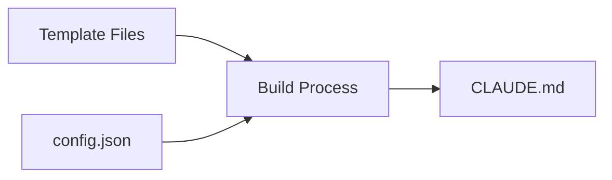

# Template System Guide

[← Back to Documentation](./README.md)

## Overview

Codery uses a template variable system to customize documentation for your specific project. This ensures AI assistants receive instructions tailored to your exact setup.

## How It Works

1. **Template files** contain placeholder variables in `{{variable}}` format
2. **Your configuration** provides values for these variables
3. **The build process** replaces placeholders with your values
4. **Result**: Customized documentation specific to your project

## Available Template Variables

| Variable | Description | Config Field | Default |
|----------|-------------|--------------|---------|
| `{{cloudId}}` | Your Atlassian instance URL | `cloudId` | (required) |
| `{{projectKey}}` | JIRA project identifier | `projectKey` | (required) |
| `{{developBranch}}` | Development branch name | `developBranch` | `"develop"` |
| `{{mainBranch}}` | Production branch name | `mainBranch` | `"main"` |

## Template Substitution Process



During `codery build`:
1. Reads all template documentation files
2. Loads your `.codery/config.json`
3. Searches for `{{variable}}` patterns
4. Replaces with corresponding values
5. Outputs customized documentation

## Real-World Examples

### Git Workflow Templates

**Template** (before substitution):
```markdown
## Feature Development

1. Start from {{developBranch}}:
   \`\`\`bash
   git checkout {{developBranch}}
   git pull origin {{developBranch}}
   \`\`\`

2. Create feature branch:
   \`\`\`bash
   git checkout -b feature/{{projectKey}}-123-description
   \`\`\`

3. After PR approval, merge to {{developBranch}}
```

**Result** (after substitution with `developBranch: "dev"`, `projectKey: "ACME"`):
```markdown
## Feature Development

1. Start from dev:
   \`\`\`bash
   git checkout dev
   git pull origin dev
   \`\`\`

2. Create feature branch:
   \`\`\`bash
   git checkout -b feature/ACME-123-description
   \`\`\`

3. After PR approval, merge to dev
```

### JIRA Integration Templates

**Template**:
```markdown
Configure JIRA integration:
- Cloud ID: {{cloudId}}
- Project Key: {{projectKey}}

All branches must include {{projectKey}} in their name.
```

**Result** (with `cloudId: "https://myteam.atlassian.net"`, `projectKey: "TEAM"`):
```markdown
Configure JIRA integration:
- Cloud ID: https://myteam.atlassian.net
- Project Key: TEAM

All branches must include TEAM in their name.
```

## Using Templates Effectively

### Do's
- ✅ Use templates for project-specific values
- ✅ Keep variable names descriptive
- ✅ Document what each variable represents
- ✅ Test builds with different configurations

### Don'ts
- ❌ Don't hardcode values that might change
- ❌ Don't use templates for static content
- ❌ Don't nest template variables

## Build Options

### Standard Build
Applies all template substitutions:
```bash
codery build
```

### Preview Substitutions
See what will be built without creating files:
```bash
codery build --dry-run
```

### Skip Substitution
Build without replacing template variables:
```bash
codery build --skip-config
```

## Debugging Templates

### Check Your Configuration
```bash
cat .codery/config.json
```

### Verify Substitution
After building, search for remaining templates:
```bash
grep -n "{{" CLAUDE.md
```

If you find any, it means:
- Variable is not in your config
- Variable name is misspelled
- You used `--skip-config` option

## Future Enhancements

The template system is designed for expansion. Potential future features:

- **Custom Variables**: Define your own template variables
- **Conditional Sections**: Include/exclude based on configuration
- **Computed Values**: Variables derived from other variables
- **External Data**: Pull values from environment or files

## Summary

Templates make Codery documentation adaptable to any project setup. By separating content from configuration, the same documentation templates can serve projects with different:
- Branch naming conventions
- JIRA configurations
- Team structures
- Workflow preferences

This ensures AI assistants always have accurate, project-specific instructions.